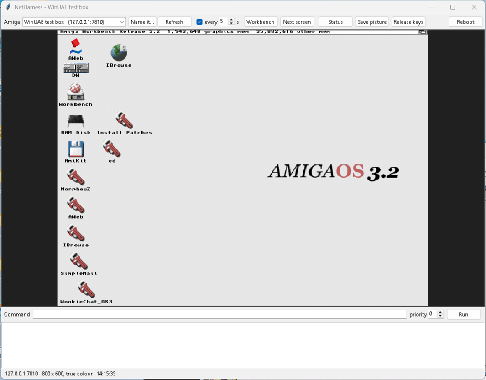

# NetHarness

Remote-control a real Amiga over TCP/IP. Run commands, capture the screen,
inject mouse and keyboard input, and reboot it — all from another machine, with
nobody sitting at the Amiga.

```
$ nhctl.py --host 192.168.1.32 EXEC version
rc=0
Kickstart 47.115, Workbench 47.5

$ nhctl.py --host 192.168.1.32 SCREENSHOT desktop.png
OK desktop.png 1024x768x24
```

It exists because testing Amiga software normally means physically sitting at
the machine: clicking through a GUI, squinting at a screen, and power-cycling
by hand. NetHarness turns that into something a script can drive.

## What it does

| Command | |
|---|---|
| `EXEC <command>` | Run any AmigaDOS command; returns its exit code **and its output** |
| `SCREENSHOT [file]` | Capture the front screen as a PNG |
| `CLICK x y`, `MOVETO`, `MOVE`, `BUTTON` | Mouse, injected at hardware level |
| `TYPE <text>`, `PRESSKEY`, `KEY`, `CLEARFIELD` | Keyboard, with shift handled |
| `RESETINPUT` | Release any stuck buttons or qualifiers |
| `REBOOT` | Cold-reboot the machine (flushes disks first) |
| `PING` | Liveness check |
| `VERSION` | The harness version (1.10+) |

Input is injected through `input.device` (`IND_WRITEEVENT`), the same path real
hardware uses, so it exercises window activation, GadTools, menus — everything
a genuine click would.

### New in 1.3 — stop guessing pixels

| Command | |
|---|---|
| `UITREE` | The front screen's windows and gadgets: id, kind, bounds, label, string contents |
| `UICLICK <text>` / `UICLICKID <id>` | Click a gadget **by identity**, not coordinates |
| `MENUS` / `MENUSEL <menu> <item>` | Enumerate the menu strip; pick an item **by name** |
| `POINTER` | Where the pointer actually is (it's a hardware sprite — invisible in screenshots) |
| `SHOTREGION x y w h` | Capture just a region — far cheaper than a full frame |
| `REGIONSUM x y w h` | 4-byte checksum: "has this redrawn yet?" |
| `WAITCHANGE x y w h` | Block until a region actually changes, instead of guessing a delay |
| `GETFILE` / `PUTFILE` | Binary-safe file transfer — deploy a build through the harness itself |
| `SCREENS` | List open screens, front to back |
| `netharness [port]` | Listen port is an argument, so a new build can be tested beside the running one |

**New in 1.4:**

| Command | |
|---|---|
| `RELOAD` | Apply a staged `C:netharness.new` and **restart the harness in place - no machine reboot** |

**New in 1.5:**

- Plays fair with the TCP/IP stack's own shutdown: the harness blocks in
  `WaitSelect` on socket **and** break signal, so a stack shutdown (Roadshow's
  `NetShutdown`) sees it release `bsdsocket.library` immediately instead of
  timing out against a blocked `accept()`/`recv()` and deferring the teardown.

**New in 1.6:**

- Send-stall guard: a controller that vanishes mid-transfer no longer freezes
  the harness in a blocking `send()` - every send waits for writability first
  (20 s cap), then the dead client is dropped.
- Idle-client reaper: a silent client is disconnected after 600 s, so a
  controller that died without closing can't hold the single client slot.

**New in 1.7:**

- Bring-up retries forever instead of giving up after 60 s: 2 s apart for the
  first minute, then every 10 s (CTRL-C aborts the wait). The harness now
  self-connects whenever its network path appears late - a companion Pi still
  booting, WiFi rejoining, or the stack restarting - with no manual run needed
  at the machine.

**New in 1.10:**

- `EXEC` can no longer wedge the harness: the command runs in a helper
  process with a time limit (`nhctl.py --timeout SECS`, default 120). When it
  runs out the command gets Ctrl-C and you get its output so far with
  `rc=TIMEOUT`; one that ignores Ctrl-C is left running and named in the reply,
  and the harness carries on serving.
- One harness per port: a second copy on a port that already has a live
  harness exits at once (a doubled line in `S:User-Startup` is harmless).
- `RELOAD` updates and restarts the binary the harness was started from, on
  its own port - before, it assumed `C:netharness` on 7800. `nhctl.py UPDATE
  <file>` stages the new build in the right place and reloads in one step.
- `nhctl.py VERSION` asks the harness its version, path and port. Older
  harnesses still work with the new `nhctl.py`.

**New in 1.9:**

- Injected keys carry every qualifier, not only Shift: `KEY` presses of Ctrl
  (0x63), Alt (0x64/0x65) and Amiga (0x66/0x67) now reach the following keys
  as combinations. So Amiga-key menu shortcuts (e.g. Right Amiga + E opens
  Workbench's Execute Command), Alt-key hotkeys and Ctrl-key commands can be
  tested: `KEY 0x67 1`, `PRESSKEY 0x12`, `KEY 0x67 0`. The host tool now takes key
  codes in decimal or `0x` hex.

**New in 1.8:**

- Client allowlist: only controllers listed in `ENV:NetHarness.allow` may
  connect. Entries are exact IPv4 addresses (`192.168.1.10`), prefixes ending
  in a dot (`192.168.1.`) or `*`, separated by spaces or newlines; loopback is
  always allowed. The file is re-read on every connect. Put it in `ENVARC:` too
  so it survives a reboot:
  `echo "192.168.1.10" >ENVARC:NetHarness.allow` + `copy ENVARC:NetHarness.allow ENV:`.
  With no file the harness still accepts anyone (so an upgrade can't lock you
  out) and logs a warning to `T:netharness.log` on each connect.
- Length-field hardening: a GETFILE/PUTFILE/EXEC length too big for the
  command buffer now drops the client instead of wrapping negative and walking
  the parser out of its buffer (stray bytes could run as commands).

`UITREE` + `UICLICK` are the headline: drive the GUI by *what things are*.

```
$ nhctl.py UITREE
W 0 0 11 332 199 "Time Preferences"
G 16 STRING 58 29 44 8 "" "2026"
G 15 GADGET 128 146 192 10 "Hours" ""
```

**Honest limitation:** some gadgets expose no text to Intuition — OS 3.2 Prefs'
Save/Use/Cancel buttons report empty labels because those apps draw the text
themselves. Slider labels and string-gadget contents do come through. Use
`UICLICKID <id>` for such buttons, `UICLICK <text>` everywhere else.

Every input command is acknowledged **after injection**, so `OK` means the
Amiga really did it — not merely that a packet was sent.

## Why EXEC matters

Driving a GUI blind is miserable: you guess coordinates, click, screenshot,
and hope. `EXEC` avoids most of that — anything expressible as a Shell command
is one call, with output returned to you. Combined with ARexx it reaches inside
applications too:

```
nhctl.py EXEC 'rx "address IBROWSE; ''GOTOURL https://aminet.net''"'
```

## Getting started

**Requirements:** a 68020 or better (the release binary is built `-m68020`),
AmigaOS 3.0 or newer (screen capture uses graphics.library V39), and any TCP/IP
stack providing `bsdsocket.library` — Roadshow, AmiTCP, Miami, a314bsd…

**On the Amiga**, double-click the `Install` icon in the NetHarness drawer, or
from a Shell in that drawer:

```
Execute Install
Run >NIL: C:netharness
```

It listens on TCP port **7800**. To start it at every boot, add that `Run` line
to the end of `S:User-Startup`, after your TCP/IP stack comes up.

One addressing nuance: with a **proxy-style stack** such as a314bsd (where the
sockets actually live on a Raspberry Pi), connect to the *proxy host's* IP —
the Amiga itself has no address of its own.

Use the installer rather than copying by hand, especially if you unpacked the
**.zip**: ZIP archives cannot carry AmigaDOS protection bits, so `netharness`
arrives without its `e` (executable) flag and the Shell refuses to run it. The
installer sets the flag for you; to do it manually:

```
Copy netharness C:
Protect C:netharness +e
```

The `.lha` archive preserves the flag, so it needs no such fixup.

**On the controlling machine** (Python 3, plus Pillow for screenshots):

```
python3 nhctl.py --host <amiga-ip> PING
python3 nhctl.py --host <amiga-ip> EXEC list SYS:
python3 nhctl.py --host <amiga-ip> --batch < commands.txt
```

`--batch` sends many commands over one connection, which is much quicker than
one invocation each.

## A remote-control window (`nhgui.py`)



`python nhgui.py [name | host[:port]]` (or double-click `nhgui.cmd` on
Windows) opens a window that shows the Amiga's front screen and passes on
what you do to it:

- **left button** - click, double-click, drag (a red ring shows where the
  click went: the Amiga's own pointer is a sprite and is not in the picture)
- **right button** - hold it and move, as on the Amiga: the menus drop down,
  the picture follows, release over an item to pick it
- **keyboard** - click the picture, then type: letters, Return, Esc, Tab,
  Backspace, Del, cursor keys, F1-F10 (F12 is Help)

Along the top: which Amiga (pick it by name, or type a name or an address and
press Return; "Name it..." keeps an address under a name), Refresh, automatic
refresh every few seconds, Workbench (left Amiga + N), Next screen (left
Amiga + M), Status, Save picture, Release keys, Reboot. Along the bottom: an
AmigaDOS command line, a priority for the command, and its output.

It is not a replacement for VNC or a remote desktop: there is no live view,
just a fresh picture after each thing you do and every few seconds (about a
quarter of a second for a 320x200 screen, two to three for 800x600 in true
colour from a 68060). It is for looking in on an Amiga in another room and
working it now and then - starting a program, answering a requester, seeing
what a test left on the screen.

`python test_nhgui.py host[:port] [x y]` drives the window's own mouse and
keyboard handlers against a live Amiga (a double-click on the RAM Disk icon
at x, y; a window drag; a menu pick with the right button; typing into a
Shell) and checks the result on the Amiga.

Each action is one short connection, so `nhctl.py` and scripts can use the
same Amiga in between. Names for your machines go in `~/.nhgui.json`:

```json
{"machines": {"A4000": "192.168.1.32:7800", "A1200": "192.168.1.33:7800"}}
```

It needs Python 3 with Tk and Pillow.

## Is it up? (`STATUS`, `WAITUP`) - 1.11

`nhctl.py STATUS` tells apart the three things a silent Amiga can be:
nothing listening on the port (booting, harness not started), connected but
no reply (busy with a command that has taken the machine over, or frozen)
and unreachable. `WAITUP [secs]` waits for it to answer, e.g. after `REBOOT`.
A ping is no substitute: a network card with its own processor can go on
answering pings while AmigaOS sits at the insert-disk screen.

`--pri N` (harness 1.11+) gives the `EXEC`'d command a task priority. A
full-screen game that never waits shares the processor with everything at
priority 0; `--pri 5 EXEC ...` gets a command in ahead of it.

## Screenshots

Screen capture handles the awkward cases real Amigas actually present:

- **Interleaved bitmaps**, which AGA Workbench screens normally use
- **True-colour RTG screens** (Picasso96/CyberGraphX) via `ReadPixelArray`
- **Planar screens** of any depth, with the screen's real palette

The mouse pointer is a hardware sprite and never appears in a capture — verify
mouse actions by their effect (a window activating, a gadget highlighting),
not by looking for the cursor.

## Notes worth knowing

- **Every input command is acknowledged** by the Amiga after injection, so
  `OK` means *delivered and injected*, not merely *sent*. Without that, a
  command that lands on nothing looks exactly like one that worked.
- **Prefer `RELOAD` over `REBOOT` for updates.** `REBOOT` calls `ColdReboot()`,
  and not every machine survives a warm CPU reset - one of the test machines
  here (an A2000) lands on a grey screen and needs a power cycle. `RELOAD` applies a staged `<harness path>.new`
  (`C:netharness.new` before 1.10) and restarts the harness in place instead, which is what rebooting was
  being used for anyway; `nhctl.py UPDATE <file>` stages and reloads in one go.
  It applies the update *while still serving*, so a failed copy leaves the
  working build running rather than bricking your remote access.
- **`REBOOT` flushes filesystems first.** `ColdReboot()` resets instantly, and
  without an explicit flush any file written moments earlier is quietly lost —
  which looks uncannily like the file "reverting" after a reboot.
- **DOS requesters are suppressed** (`pr_WindowPtr = -1`). A command touching a
  missing volume would otherwise raise "Please insert volume…" and block the
  single-threaded harness with no way to dismiss it remotely.
- **`EXEC` has a time limit (1.10).** The command runs in a helper process and
  the harness waits at most the limit (`nhctl.py --timeout SECS`, default 120;
  a 1.9-style `EXEC` gets 10 minutes). When it runs out, the command is sent
  Ctrl-C and you get its output so far with `rc=TIMEOUT`; one that ignores
  Ctrl-C is left running (the note names it) and the harness carries on.
  Before 1.10 a hung command wedged the harness until someone reached the
  machine. Long-lived programs still belong in `EXEC run >NIL: <program>`.
- **One harness per port (1.10).** A second copy started on a port that
  already has a live harness exits at once instead of retrying forever, so a
  doubled line in `S:User-Startup` costs nothing. `RELOAD` hands the port over
  as before; a copy on a spare port (`netharness 7810`) runs alongside.
- **`nhctl.py VERSION`** asks a 1.10+ harness its version (`HELLO`); an older
  one ignores the question and answers `PING`, which is how the client knows
  whether to use the time-limited `EXEC`.
- There is **no authentication**. It executes commands as sent — use it on a
  network you trust, not a public one.

## Which version is installed?

The binary carries a standard AmigaDOS version cookie:

```
$ nhctl.py --host <ip> EXEC "version C:netharness full"
netharness 1.10 (30.9.2026)
```

The 1.10.1 package carries the 1.10 binary, so it reports `1.10`: 1.10.1 only
added the installer and drawer icons.

## Building

```
cd amiga && make        # needs the bebbo amiga-gcc cross-compiler
```

The Amiga side is a single C file using only standard `bsdsocket.library`
calls, built `-m68020` — change that to `-m68000` in `amiga/Makefile` if you
need it to run on a stock 68000 machine.

## Licence

MIT — see [LICENSE](LICENSE).
